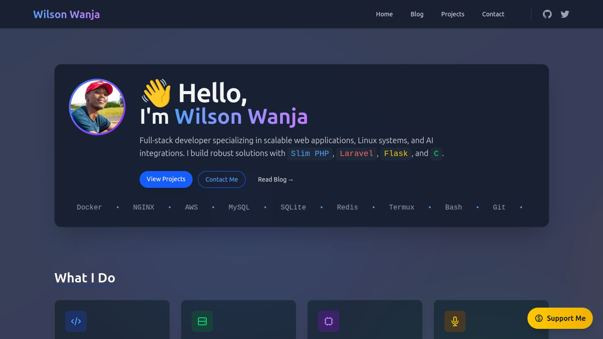

# Wilson Wanja - Full-Stack Developer Portfolio



A modern portfolio and technical blog showcasing my work as a full-stack developer, built on the Slim PHP framework.

## Features

- **Modern UI/UX** with dark/light mode toggle
- **Responsive Design** optimized for all devices
- **Performance Focused** (95+ Lighthouse scores)
- **Technical Blog** with Markdown support
- **Project Showcase** with interactive cards
- **Contact System** with form validation
- **Easy Content Management** via CLI

## Technology Stack

| Component          | Technology               |
|--------------------|--------------------------|
| Backend Framework  | Slim PHP 4               |
| Frontend           | Tailwind CSS + Alpine.js |
| Templating         | Twig                     |
| Database           | SQLite (for blog)        |
| Deployment Ready   | Docker configuration     |
| CI/CD              | GitHub Actions           |

## Getting Started

### Prerequisites
- PHP 8.0+
- Composer
- Node.js 16+
- SQLite (for blog functionality)

### Installation

1. Clone the repository:
```bash
git clone https://github.com/wanjaswilly/wilson.4ly.me.git ./your-folder-name
cd your-folder-name
```

2. Install dependencies:
```bash
composer install
npm install && npm run build
```

3. Configure environment:
```bash
cp .env.example .env
# Edit .env with your settings
```

### Development
```bash
php slim serve
```
Visit `http://localhost:8000`

## Project Structure

```
wilson.4ly.me/
├── app/                  # Application core
│   ├── Controllers       # Request handlers
│   ├── Helpers           # Utilities (BlogGenerator, etc.)
│   └── Middlewares       # HTTP middleware
│   └── Models            # HTTP middleware
├── config/               # Configuration files
│   ├── app.php           # Main config
│   └── projects.php      # Projects data
├── database/             # Database migrations
├── public/               # Web root
│   ├── build/            # Compiled assets
│   └── images/           # Site images
├── resources/            # Frontend assets
│   ├── css/              # Custom styles
│   └── js/               # JavaScript
├── routes/               # Route definitions
│   └── web.php           # Main routes
├── templates/            # Twig templates
│   ├── layout.twig       # Base template
│   ├── partials/         # Reusable components
│   ├── pages/            # Page templates
│   └── errors/           # Error pages
├── .env.example          # Environment template
├── composer.json         # PHP dependencies
├── package.json          # JS dependencies
└── slim                  # Custom CLI tool
```

## Content Management

### Using the CLI Tool

| Command | Description |
|---------|-------------|
| `php slim make:page about` | Create new page |
| `php slim remove:page about` | Remove page |
| `php slim make:partial footer` | Create new partial |
| `php slim make:model modelName` | Creates new model with the name given |
| `php slim make:model modelName -m` | Creates new model with the name given and a migration for it |
| `php slim migrate` | runs all pending migrations |
| `php slim serve` | Start dev server |

### Adding Blog Posts
1. Create an admin user then log in to admin panel
2. Create a blog under blogs

### Managing Projects
Log in to the admin panel and choose add a new project

## Deployment

### Docker
```bash
docker-compose up -d --build
```

### Traditional/Apache/Nginx
1. Configure web server to point to `public/`
2. Set production environment variables
3. Run:
```bash
composer install
npm run build

```

## Contact

- Email: [wilson@4ly.me](mailto:wilson@4ly.me)
- Twitter: [@wanjaswilly](https://twitter.com/wanjaswilly)
- GitHub: [wanjaswilly](https://github.com/wanjaswilly)


## License

This project is licensed under the **Creative Commons Attribution-NonCommercial 4.0 International (CC BY-NC 4.0)** license.

You are free to:
- **Share** — copy and redistribute the material in any medium or format
- **Adapt** — remix, transform, and build upon the material

Under the following terms:
- **Attribution** — You must give appropriate credit, provide a link to the license, and indicate if changes were made.
- **NonCommercial** — You may not use the material for commercial purposes.

### 🔗 Full License
[CC BY-NC 4.0 License](https://creativecommons.org/licenses/by-nc/4.0/)

© Wanja Wilson, 2025.

---

Built with the [Slim Simple Site Skeleton](https://github.com/wanjaswilly/slim-site-skeleton)

